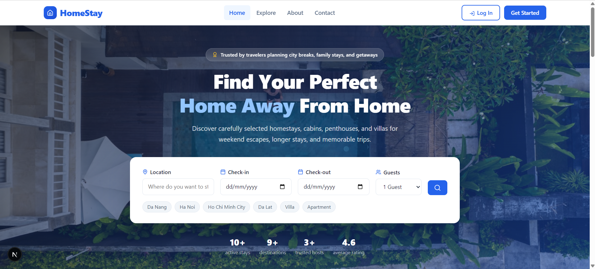
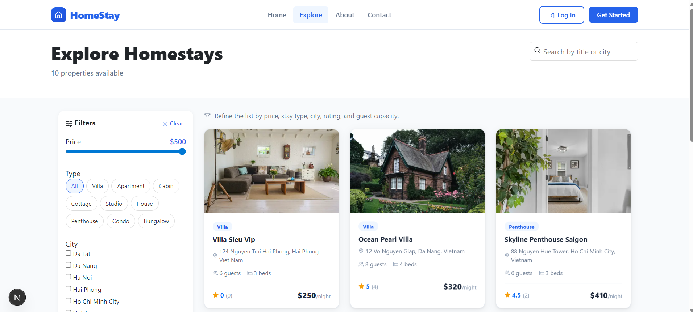
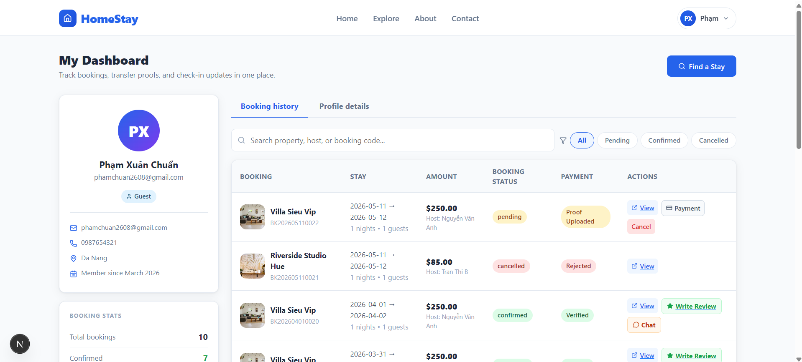
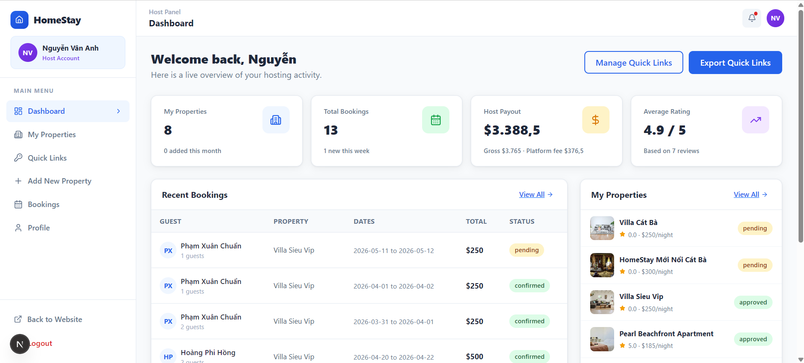
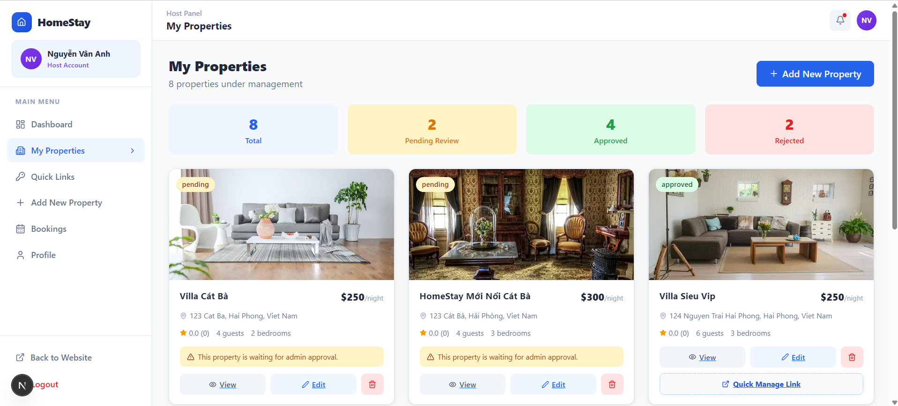
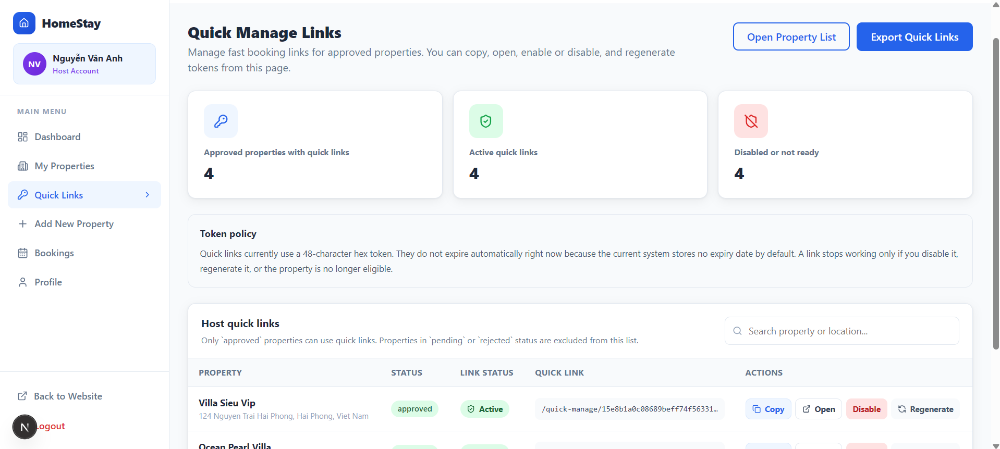
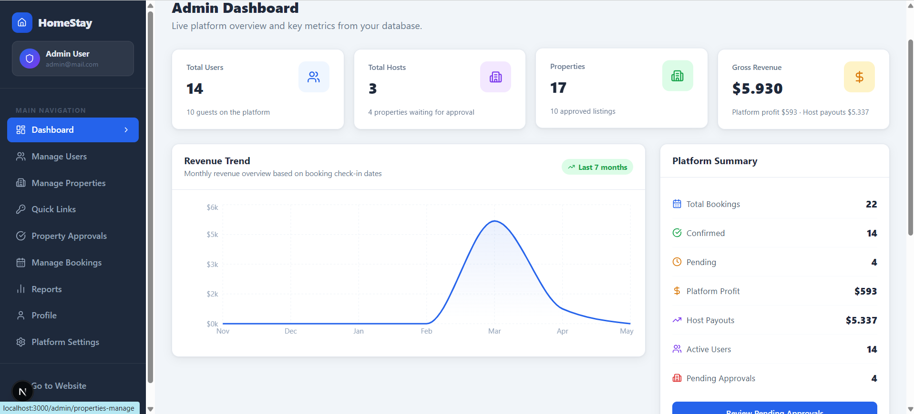
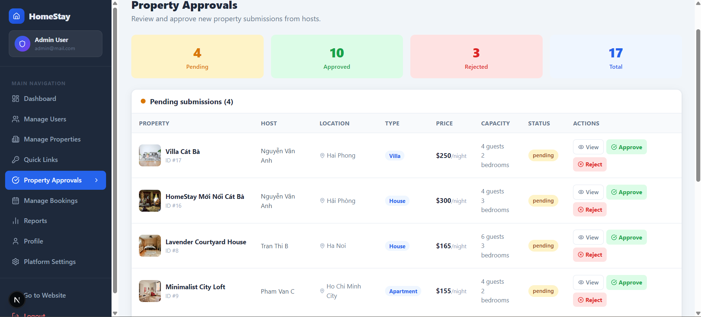
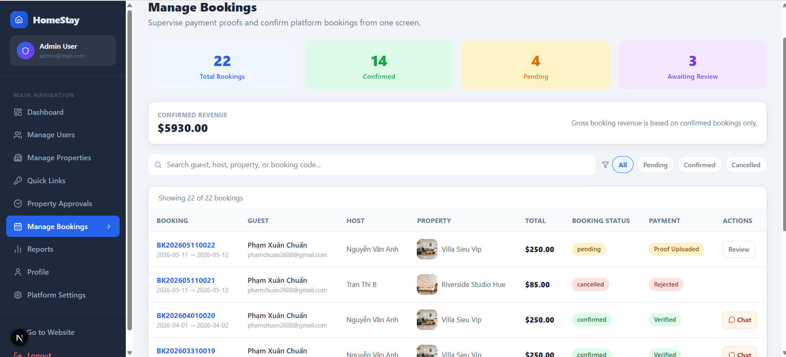
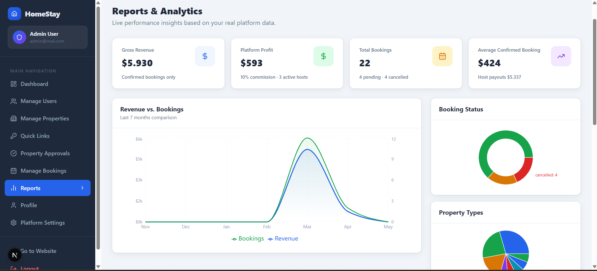

# 🏠 Homestay Booking & Management Platform

<p align="center">
  
  
  
  
  
</p>

<p align="center">
  <strong>Full-Stack Homestay Reservation Platform</strong><br>
  Built with Next.js, React.js, Node.js, Express.js and MySQL
</p>

---

# 📖 Overview

Homestay Booking & Management Platform is a full-stack web application that connects travelers with property owners through a modern online reservation system.

The platform provides dedicated workspaces for Guests, Hosts, and Administrators, supporting property listing management, booking workflows, payment verification, reporting, and platform moderation.

---

# ✨ Key Features

## 👤 Guest Portal

* User Registration & Authentication
* Homestay Search & Discovery
* Advanced Filtering System
* Online Booking
* Booking History
* Payment Proof Submission
* Reviews & Ratings
* Real-time Chat Support
* Profile Management

## 🏡 Host Portal

* Host Dashboard
* Property Management
* Property Listing Creation
* Image Upload Management
* Reservation Processing
* Revenue Monitoring
* Quick Booking Links
* Guest Communication

## 🛡 Admin Portal

* Platform Dashboard
* User Management
* Host Management
* Property Moderation
* Booking Monitoring
* Revenue Analytics
* Reports & Statistics
* Platform Configuration

---

# 🚀 Technology Stack

## Frontend

* Next.js
* React.js
* TypeScript
* Tailwind CSS

## Backend

* Node.js
* Express.js
* RESTful API

## Database

* MySQL

## Security

* JWT Authentication
* Role-Based Access Control (RBAC)

## Development Tools

* Git
* GitHub
* Postman
* Visual Studio Code

---

# 👥 System Roles

| Role  | Responsibility                     |
| ----- | ---------------------------------- |
| Guest | Search and book homestays          |
| Host  | Manage properties and reservations |
| Admin | Manage platform operations         |

---

# 🏗 System Architecture

```text
Client (Next.js + React)
            │
            ▼
      REST API Server
       (Express.js)
            │
            ▼
          MySQL
```

---

# 📸 System Screenshots

## 🏠 Home Page

Landing page allowing users to search homestays by location, date and guest capacity.

<p align="center">
  
</p>

---

## 🔍 Explore Homestays

Browse available properties with advanced filters including city, property type and pricing.

<p align="center">
  
</p>

---

## 👤 Guest Dashboard

Guests can manage bookings, payments, reviews and personal profile information.

<p align="center">
  
</p>

---

## 🏡 Host Dashboard

Hosts can monitor bookings, revenue and property performance in one place.

<p align="center">
  
</p>

---

## 🏘 Property Management

Hosts can create, update and manage homestay listings.

<p align="center">
  
</p>

---

## ⚡ Quick Booking Links

Generate and manage direct booking links for approved properties.

<p align="center">
  
</p>

---

## 🛡 Admin Dashboard

Platform-wide statistics including users, bookings, revenue and property metrics.

<p align="center">
  
</p>

---

## ✅ Property Approval Workflow

Administrators review and approve property submissions from hosts.

<p align="center">
  
</p>

---

## 📅 Booking Management

Centralized booking management including payment verification and reservation tracking.

<p align="center">
  
</p>

---

## 📈 Reports & Analytics

Revenue reports, booking trends and platform performance analytics.

<p align="center">
  
</p>

---

# 🗄 Database Design

Core entities:

* Users
* Properties
* Bookings
* Reviews
* Amenities
* Property Images
* Conversations
* Messages
* App Settings

---

# 👨‍💻 My Contributions

As Full-Stack Developer, I participated in:

* Database Design
* REST API Development
* Authentication & Authorization
* Property Management Module
* Booking Workflow
* Payment Verification
* Dashboard Development
* Admin Management Features
* UI/UX Implementation

---

# 📊 Project Highlights

* Multi-role System (Guest / Host / Admin)
* Property Approval Workflow
* Booking & Reservation Management
* Revenue Analytics Dashboard
* Quick Booking Link System
* Responsive UI Design
* JWT Authentication
* RESTful API Architecture

---

# ⚙️ Installation

### Clone Repository

```bash
git clone https://github.com/pJuan2005/booking-homestay.git
```

### Frontend

```bash
cd frontend
npm install
npm run dev
```

### Backend

```bash
cd backend
npm install
npm run dev
```

### Environment Variables

```env
DB_HOST=
DB_PORT=
DB_USER=
DB_PASSWORD=
DB_NAME=
JWT_SECRET=
```

---

# 🎓 Academic Information

Software Development Course Project

Hung Yen University of Technology and Education

Bachelor of Information Technology (Software Engineering)

---

# 📬 Contact

### Pham Xuan Chuan

📧 [phamchuan2608@gmail.com](mailto:phamchuan2608@gmail.com)

🔗 LinkedIn: https://linkedin.com/in/phamxuanchuan

💻 GitHub: https://github.com/pJuan2005

---

<p align="center">
⭐ If you found this project interesting, feel free to give it a star.
</p>
