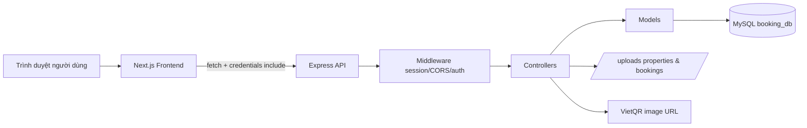
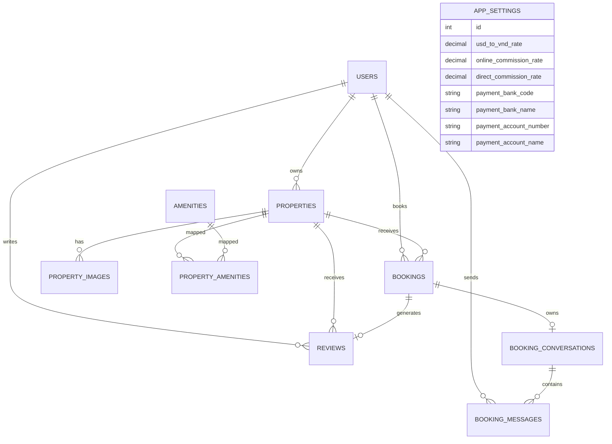
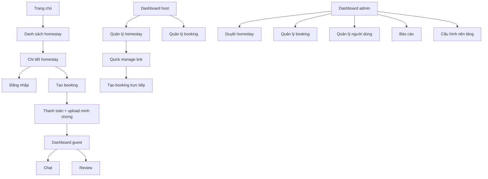

# BÁO CÁO CHI TIẾT DỰ ÁN WEBSITE THUÊ HOMESTAY

> Tài liệu này được tổng hợp trực tiếp từ mã nguồn tại `d:\Nodejs\LearnSchool\booking-homestay` và bám theo khung nội dung của file mẫu `d:\Nodejs\BaoCao\Mẫu báo cáo Công nghệ web và ứng dụng.doc`.
>
> Thời điểm tổng hợp mã nguồn: ngày 07/05/2026.

## Ghi chú sử dụng tài liệu

- Tài liệu này tập trung vào phần chuyên môn, kỹ thuật, kiến trúc, chức năng và triển khai của hệ thống.
- Các thông tin hành chính như tên trường, khoa, giảng viên hướng dẫn, sinh viên thực hiện, lớp, mã số sinh viên, lời cảm ơn, lời cam đoan, nhận xét của giảng viên cần được điền thủ công theo yêu cầu học phần.
- Nội dung bên dưới phản ánh đúng hiện trạng codebase tại thời điểm đọc mã nguồn, không phải mô tả giả định.
- Một số chỗ có thể dùng trực tiếp cho báo cáo, một số chỗ nên rút gọn khi đưa vào bản Word chính thức.

## Trang bìa gợi ý

- Tên đề tài: Xây dựng website đặt thuê homestay trực tuyến
- Tên hệ thống: HomeStay Booking Platform
- Sinh viên thực hiện: [Điền thông tin]
- Giảng viên hướng dẫn: [Điền thông tin]
- Học phần: Công nghệ web và ứng dụng
- Thời gian thực hiện: [Điền học kỳ/năm học]

## Nguồn mã đã được phân tích

- Khối backend:
  - `backend/app.js`
  - `backend/bin/www`
  - `backend/routes/*`
  - `backend/controllers/*`
  - `backend/models/*`
  - `backend/middlewares/*`
  - `backend/common/*`
  - `backend/database/booking_db.sql`
  - `backend/database/seed_app_data.sql`
- Khối frontend:
  - `frontend/app/**/*`
  - `frontend/components/**/*`
  - `frontend/services/*`
  - `frontend/lib/*`
  - `frontend/next.config.ts`
  - `frontend/app/globals.css`

## Danh mục thuật ngữ và từ viết tắt

| Thuật ngữ | Ý nghĩa |
| --- | --- |
| Frontend | Phần giao diện người dùng, chạy phía trình duyệt |
| Backend | Phần xử lý nghiệp vụ và cung cấp API |
| API | Giao diện lập trình ứng dụng giữa frontend và backend |
| REST | Kiểu thiết kế API theo tài nguyên và HTTP method |
| Session | Cơ chế lưu trạng thái đăng nhập phía server |
| RBAC | Role-Based Access Control, phân quyền theo vai trò |
| Guest | Người dùng thuê homestay |
| Host | Chủ homestay |
| Admin | Quản trị viên hệ thống |
| VietQR | Chuẩn mã QR dùng để thanh toán/chuyển khoản tại Việt Nam |
| CSDL | Cơ sở dữ liệu |
| Upload | Tải tệp/ảnh từ máy người dùng lên hệ thống |
| Quick Manage Link | Liên kết quản lý nhanh homestay dựa trên token |

## Danh mục bảng và hình minh họa gợi ý

### Bảng gợi ý

- Bảng 2.1. Công nghệ sử dụng ở backend
- Bảng 2.2. Công nghệ sử dụng ở frontend
- Bảng 3.1. Vai trò và quyền của các nhóm người dùng
- Bảng 3.2. Mô tả các bảng dữ liệu chính
- Bảng 3.3. Yêu cầu chức năng của phân hệ người dùng
- Bảng 3.4. Yêu cầu chức năng của phân hệ chủ homestay
- Bảng 3.5. Yêu cầu chức năng của phân hệ quản trị
- Bảng 4.1. Danh sách API chính của hệ thống
- Bảng 4.2. Kịch bản kiểm thử tiêu biểu

### Hình gợi ý

- Hình 2.1. Kiến trúc tổng thể frontend-backend-database
- Hình 3.1. Biểu đồ thực thể liên kết của cơ sở dữ liệu
- Hình 3.2. Giao diện trang chủ
- Hình 3.3. Giao diện trang danh sách homestay
- Hình 3.4. Giao diện trang chi tiết homestay
- Hình 3.5. Giao diện dashboard người dùng
- Hình 3.6. Giao diện dashboard host
- Hình 3.7. Giao diện dashboard admin
- Hình 4.1. Luồng đặt phòng và tải minh chứng thanh toán
- Hình 4.2. Luồng phê duyệt homestay
- Hình 4.3. Luồng đặt phòng trực tiếp bằng quick-manage link

# Chương 1. Tổng quan về đề tài

## 1.1 Lý do chọn đề tài

Trong bối cảnh ngành du lịch và lưu trú phát triển mạnh, nhu cầu đặt phòng trực tuyến ngày càng cao. Các mô hình homestay, villa, apartment hay cabin không chỉ xuất hiện ở các thành phố lớn mà còn phát triển tại các khu du lịch như Đà Lạt, Đà Nẵng, Hội An, Nha Trang. Tuy nhiên, nhiều chủ homestay nhỏ lẻ vẫn quản lý thông tin phòng, lịch đặt và thanh toán theo cách thủ công, dễ gây trùng lịch, khó theo dõi doanh thu và khó kiểm soát trải nghiệm khách hàng.

Từ thực tế đó, đề tài xây dựng website thuê homestay được thực hiện nhằm tạo ra một hệ thống quản lý và đặt phòng trực tuyến có đầy đủ các vai trò:

- Khách thuê có thể tìm kiếm homestay, xem chi tiết, đặt phòng, gửi minh chứng thanh toán, đánh giá sau khi ở.
- Chủ homestay có thể đăng tin, chỉnh sửa nội dung, quản lý đặt phòng, trao đổi với khách, theo dõi doanh thu.
- Quản trị viên có thể duyệt homestay, quản lý người dùng, duyệt thanh toán, xem báo cáo và cấu hình tài chính nền tảng.

Điểm đáng chú ý của dự án là hệ thống không chỉ dừng ở chức năng đặt phòng online cơ bản mà còn hỗ trợ quick-manage link để chủ homestay tạo đặt phòng trực tiếp cho khách walk-in hoặc khách đặt qua điện thoại. Tính năng này làm cho hệ thống gần với bối cảnh kinh doanh thực tế hơn.

## 1.2 Mục tiêu của đề tài

### 1.2.1 Mục tiêu tổng quát

Xây dựng một website đặt thuê homestay hoạt động theo mô hình full-stack, có khả năng quản lý người dùng, homestay, đơn đặt phòng, thanh toán chuyển khoản, phê duyệt nội dung, thống kê doanh thu và hỗ trợ vận hành thực tế cho cả khách thuê, chủ homestay và quản trị viên.

### 1.2.2 Mục tiêu cụ thể

- Xây dựng giao diện website cho phép người dùng tìm kiếm và xem danh sách homestay theo vị trí, loại chỗ ở, số khách, khoảng ngày lưu trú.
- Cung cấp màn hình chi tiết homestay với hình ảnh, tiện nghi, lịch bận, đánh giá, thông tin chủ nhà.
- Xây dựng chức năng đăng ký, đăng nhập, cập nhật hồ sơ và đổi mật khẩu.
- Xây dựng chức năng đặt phòng online với kiểm tra trùng lịch, kiểm soát ngày hợp lệ, sinh mã đặt phòng và thông tin thanh toán QR.
- Hỗ trợ khách tải ảnh minh chứng thanh toán chuyển khoản.
- Hỗ trợ host/admin duyệt thanh toán để chuyển đặt phòng sang trạng thái xác nhận hoặc từ chối.
- Hỗ trợ đánh giá homestay sau khi khách đã hoàn thành kỳ lưu trú.
- Hỗ trợ nhắn tin theo từng booking đã được xác nhận.
- Cho phép host tạo và sử dụng quick-manage link để ghi nhận booking trực tiếp.
- Xây dựng dashboard và báo cáo doanh thu cho host và admin.
- Quản lý cấu hình tài chính nền tảng như tỷ giá USD/VND, phần trăm hoa hồng online/direct, tài khoản nhận tiền.

## 1.3 Giới hạn và phạm vi của đề tài

### 1.3.1 Đối tượng nghiên cứu

- Kiến trúc web full-stack tách frontend và backend.
- Hệ quản trị cơ sở dữ liệu quan hệ MySQL.
- Luồng xác thực bằng session.
- Mô hình phân quyền 3 vai trò: `guest`, `host`, `admin`.
- Nghiệp vụ đặt homestay trực tuyến và quản trị vận hành nội dung.

### 1.3.2 Phạm vi nghiên cứu

Hệ thống trong phiên bản hiện tại tập trung vào:

- Quản lý danh sách homestay, ảnh, tiện nghi, lịch đặt.
- Đặt phòng và xác nhận thanh toán bằng hình thức chuyển khoản thủ công.
- Quản lý vận hành cơ bản cho host và admin.
- Thống kê doanh thu, hoa hồng nền tảng và lợi nhuận host.

Những nội dung chưa nằm trong phạm vi triển khai hoàn chỉnh của phiên bản hiện tại:

- Chưa tích hợp cổng thanh toán online tự động như VNPay, MoMo, Stripe.
- Chưa có kiểm thử tự động bằng unit test hoặc end-to-end test.
- Chưa có hệ thống gửi email/SMS xác nhận.
- Chưa có ứng dụng di động riêng.
- Cấu hình kết nối database hiện đang hard-code trong code backend, chưa tách hoàn toàn ra biến môi trường.

## 1.4 Nội dung thực hiện

Đề tài được triển khai thành các nhóm nội dung chính:

- Khảo sát và xác định bài toán đặt thuê homestay trực tuyến.
- Thiết kế mô hình dữ liệu cho người dùng, homestay, booking, review, chat, thiết lập nền tảng.
- Xây dựng backend bằng Express.js để xử lý API, session, phân quyền, upload ảnh và nghiệp vụ đặt phòng.
- Xây dựng frontend bằng Next.js App Router để hiển thị giao diện public, guest, host và admin.
- Xây dựng dashboard thống kê cho host và admin.
- Xây dựng cơ chế quick-manage link phục vụ đặt phòng trực tiếp.
- Tạo dữ liệu mẫu và kiểm thử thủ công trên các luồng nghiệp vụ chính.

## 1.5 Phương pháp tiếp cận

Dự án được triển khai theo hướng phát triển tăng dần chức năng:

- Bước 1: Thiết kế dữ liệu nền tảng gồm user, property, booking, review.
- Bước 2: Hoàn thiện xác thực, phân quyền, quản lý listing, duyệt nội dung.
- Bước 3: Hoàn thiện luồng đặt phòng online, thanh toán chuyển khoản và phê duyệt thanh toán.
- Bước 4: Mở rộng chat, review, báo cáo doanh thu và quick-manage link.
- Bước 5: Hoàn thiện giao diện người dùng, dashboard quản trị và dữ liệu mẫu.

Phương pháp này phù hợp với dự án học phần vì giúp phát triển theo từng cụm nghiệp vụ rõ ràng, dễ kiểm thử, dễ bổ sung tính năng.

# Chương 2. Cơ sở lý thuyết

## 2.1 Quy trình phát triển phần mềm

Xét trên mã nguồn hiện tại, dự án không được tổ chức theo Waterfall cứng mà gần với mô hình phát triển lặp tăng dần. Các đặc điểm thể hiện qua cấu trúc code:

- Backend được chia thành `routes -> controllers -> models -> common/middlewares`, cho thấy hệ thống được thiết kế theo lớp trách nhiệm.
- Frontend chia thành `app`, `components`, `services`, `lib`, cho thấy định hướng component-based và service abstraction.
- Nghiệp vụ mở rộng được thêm dần sau cấu trúc nền: ví dụ `quick-manage`, `platform-settings`, `admin-reports`, `chat`, `review`.
- Dữ liệu seed mô phỏng nhiều trạng thái booking khác nhau để phục vụ kiểm thử tăng dần theo tính năng.

Có thể mô tả quy trình phát triển của đề tài theo 5 vòng lặp:

1. Thiết kế cơ sở dữ liệu và xác định vai trò người dùng.
2. Xây dựng API cho đăng nhập, quản lý homestay và đặt phòng.
3. Xây dựng giao diện public và dashboard cho guest/host/admin.
4. Bổ sung nghiệp vụ tài chính, upload minh chứng và báo cáo.
5. Kiểm thử thủ công, hoàn thiện trải nghiệm giao diện và dữ liệu mẫu.

## 2.2 Lập trình phía back-end

### 2.2.1 Công nghệ backend sử dụng

| Thành phần | Công nghệ | Vai trò |
| --- | --- | --- |
| Runtime | Node.js | Môi trường chạy server JavaScript |
| Framework | Express `4.16.1` | Tạo HTTP server và tổ chức routing |
| Session | `express-session` `1.19.0` | Quản lý đăng nhập bằng session phía server |
| Hash mật khẩu | `bcryptjs` `3.0.3` | Mã hóa mật khẩu người dùng |
| Database driver | `mysql` `2.18.1`, `mysql2` `3.20.0` | Kết nối và query MySQL |
| Upload | `multer` `2.1.1` | Nhận tệp ảnh từ request |
| Xử lý ảnh | `sharp` `0.34.5` | Sinh các biến thể ảnh `thumb` và `medium` |
| CORS | `cors` `2.8.6` | Cho phép frontend truy cập backend |
| Logging | `morgan` `1.9.1` | Ghi log request HTTP |
| Cookie parser | `cookie-parser` `1.4.4` | Đọc cookie từ request |

### 2.2.2 Kiến trúc backend

Backend được tổ chức theo mô hình tách lớp:

- `routes`: định nghĩa endpoint và middleware bảo vệ.
- `controllers`: nhận request, validate đầu vào, điều phối nghiệp vụ.
- `models`: truy vấn CSDL, map dữ liệu.
- `middlewares`: xác thực, nạp user hiện tại, upload file.
- `common`: xử lý dùng chung như tài chính, upload, cấu hình thanh toán.



### 2.2.3 Cấu hình backend quan trọng

- File chạy ứng dụng: `backend/bin/www`
- Port mặc định: `5000` qua biến `PORT`, nếu không có sẽ dùng `5000`
- CORS cho phép:
  - `FRONTEND_URL`
  - `http://localhost:3000`
  - `http://127.0.0.1:3000`
- Session cookie:
  - Tên cookie: `hs.sid`
  - `httpOnly: true`
  - `sameSite: "lax"`
  - `secure: false`
  - Thời hạn: `7 ngày`
- Thư mục static:
  - `backend/uploads` để phục vụ ảnh homestay và ảnh minh chứng thanh toán
  - `backend/public`

### 2.2.4 Xác thực và phân quyền

Hệ thống dùng session-based authentication:

- Khi đăng nhập thành công, backend ghi `req.session.user`.
- Middleware `loadUser.middleware.js` lấy user từ session để gắn vào `req.currentUser`.
- Middleware `auth.middleware.js` cung cấp:
  - `requireAuth`: bắt buộc đăng nhập
  - `requireRoles`: bắt buộc đúng vai trò

Ba vai trò chính của hệ thống:

| Vai trò | Ý nghĩa | Quyền chính |
| --- | --- | --- |
| `guest` | Người thuê homestay | Tìm kiếm, đặt phòng, tải minh chứng, chat, đánh giá |
| `host` | Chủ homestay | Tạo listing, cập nhật listing, xem booking, duyệt minh chứng, quick-manage |
| `admin` | Quản trị viên | Quản lý toàn cục người dùng, booking, property, cấu hình và báo cáo |

Các ràng buộc đáng chú ý:

- Tài khoản bị `blocked` không được đăng nhập.
- Backend hỗ trợ tự động chuyển mật khẩu plaintext cũ sang bcrypt khi đăng nhập thành công, giúp tương thích dữ liệu legacy.
- Admin không thể tự chặn chính mình hoặc tự hạ quyền admin trong luồng quản lý người dùng.

### 2.2.5 Tổ chức API backend

Các nhóm route chính:

| Nhóm route | Prefix | Vai trò sử dụng |
| --- | --- | --- |
| Xác thực | `/api/auth` | Guest, Host, Admin |
| Public property | `/api/properties` | Khách chưa đăng nhập và người dùng đã đăng nhập |
| Guest booking | `/api/bookings` | Guest |
| Review | `/api/reviews` | Guest |
| Host property | `/api/host/properties` | Host |
| Host booking | `/api/host/bookings` | Host |
| Host dashboard | `/api/host/dashboard` | Host |
| Admin property | `/api/admin/properties` | Admin |
| Admin user | `/api/admin/users` | Admin |
| Admin booking | `/api/admin/bookings` | Admin |
| Admin dashboard | `/api/admin/dashboard` | Admin |
| Admin report | `/api/admin/reports` | Admin |
| Admin setting | `/api/admin/settings` | Admin |
| Quick manage | `/api/quick-manage/:token` | Truy cập theo token |

### 2.2.6 Xử lý tệp và hình ảnh

Hệ thống có hai luồng upload riêng:

1. Upload ảnh homestay:
   - Dùng `multer.memoryStorage()`
   - Chỉ nhận `image/*`
   - Tối đa `10` ảnh/request
   - Mỗi ảnh tối đa `15MB`
   - Lưu tại `backend/uploads/properties/{propertyId}/{cover|details}`
   - Sinh thêm biến thể:
     - `thumb`: `480x320`, WebP
     - `medium`: rộng `1280px`, WebP

2. Upload ảnh minh chứng thanh toán:
   - Dùng `multer.memoryStorage()`
   - Tối đa `1` ảnh/request
   - Kích thước tối đa `15MB`
   - Lưu tại `backend/uploads/bookings/{bookingId}/payment-proof`

Ưu điểm của cách triển khai:

- Giảm dung lượng ảnh hiển thị nhờ biến thể WebP.
- Tổ chức ảnh theo từng `propertyId` hoặc `bookingId`, dễ quản lý.
- Có hàm xóa ảnh đã quản lý khi listing bị sửa/xóa.

### 2.2.7 Nghiệp vụ tài chính backend

Khối `backend/common/bookingFinance.js` và `backend/common/paymentConfig.js` xử lý:

- Quy đổi tỷ giá từ USD sang VND
- Tính hoa hồng nền tảng
- Tính số tiền host thực nhận
- Sinh thông tin thanh toán và URL ảnh QR VietQR

Giá trị mặc định:

| Tham số | Giá trị mặc định |
| --- | --- |
| `USD_TO_VND_RATE` | `25000` |
| `PLATFORM_COMMISSION_RATE` | `0.1` tức `10%` |
| `DIRECT_COMMISSION_RATE` | `0.05` tức `5%` |
| `PAYMENT_BANK_CODE` | `TCB` |
| `PAYMENT_BANK_NAME` | `Techcombank` |
| `PAYMENT_ACCOUNT_NUMBER` | `19071766471019` |
| `PAYMENT_ACCOUNT_NAME` | `PHAM XUAN CHUAN` |

Ý nghĩa nghiệp vụ:

- Giá homestay trong hệ thống đang được xử lý theo đơn vị USD ở nhiều màn hình.
- Khi cần thanh toán chuyển khoản, backend quy đổi sang VND để tạo mã QR.
- Booking online dùng hoa hồng nền tảng mặc định 10%.
- Booking trực tiếp từ quick-manage link dùng hoa hồng trực tiếp mặc định 5%.

## 2.3 Lập trình phía front-end

### 2.3.1 Công nghệ frontend sử dụng

| Thành phần | Công nghệ | Vai trò |
| --- | --- | --- |
| Framework | Next.js `16.1.6` | Xây dựng ứng dụng React theo App Router |
| UI library | React `19.2.3` | Xây dựng component giao diện |
| Ngôn ngữ | TypeScript `5` | Tăng độ an toàn kiểu dữ liệu |
| Chart | `recharts` `3.8.0`, `chart.js` `4.5.1`, `react-chartjs-2` `5.3.1` | Hiển thị dashboard và báo cáo |
| Date | `date-fns` `4.1.0`, `react-datepicker` `9.1.0` | Chọn ngày và xử lý lịch |
| Icon | `lucide-react` `0.577.0` | Biểu tượng giao diện |
| Styling | Bootstrap CDN + CSS custom + inline style | Trình bày giao diện |
| Linting | ESLint `9` | Kiểm tra mã nguồn frontend |

Lưu ý:

- Dự án có cài `tailwindcss`, tuy nhiên trong mã nguồn hiện tại giao diện chủ yếu đang dùng Bootstrap CDN, CSS trong `frontend/app/globals.css` và rất nhiều inline style.
- Như vậy, có thể ghi trong báo cáo rằng Tailwind có mặt trong toolchain nhưng chưa phải công nghệ styling chính của phiên bản hiện tại.

### 2.3.2 Kiến trúc frontend

Frontend dùng cấu trúc App Router:

- `frontend/app/layout.tsx`: layout gốc, nạp `AuthProvider`, Bootstrap, CSS toàn cục
- `frontend/app/(public)/*`: khu vực public và guest
- `frontend/app/host/*`: khu vực host
- `frontend/app/admin/*`: khu vực admin
- `frontend/app/quick-manage/[token]`: trang quản lý nhanh theo token

Frontend không gọi trực tiếp database mà thông qua lớp service:

- `authService`
- `propertyService`
- `bookingService`
- `reviewService`
- `chatService`
- `dashboardService`
- `reportService`
- `platformSettingsService`
- `quickManageService`
- `userService`

Tất cả request API đều đi qua `frontend/lib/apiClient.ts` với:

- `NEXT_PUBLIC_API_BASE_URL` mặc định là `http://localhost:5000`
- `credentials: "include"` để gửi cookie session

### 2.3.3 Quản lý tài nguyên ảnh ở frontend

Frontend có 2 cơ chế đáng chú ý:

- `frontend/next.config.ts` cho phép Next Image tải ảnh từ:
  - backend `/uploads/**`
  - `localhost:5000`
  - `127.0.0.1:5000`
  - `images.unsplash.com`
- `frontend/lib/image.ts` và helper ảnh giúp:
  - nhận diện ảnh upload từ backend
  - map ảnh cũ kiểu `/img/propertyN.jpg` sang tài nguyên local nếu cần

### 2.3.4 Tổ chức giao diện

Thiết kế giao diện của dự án hiện tại có các đặc điểm:

- Font chính là `Inter`
- Màu chủ đạo là xanh dương
- Có `Navbar`, `Footer`, card, table, badge, dashboard stat-card dùng chung
- Host và Admin có layout sidebar riêng
- Sử dụng CSS custom trong `globals.css` để định nghĩa design token như:
  - `--hs-primary`
  - `--hs-success`
  - `--hs-warning`
  - `--hs-danger`
  - `--hs-border`

### 2.3.5 Quản lý trạng thái đăng nhập ở frontend

`AuthContext.tsx` giữ trạng thái người dùng hiện tại:

- Tải user hiện tại từ `/api/auth/me`
- Lưu thông tin role và status
- Cung cấp hàm:
  - `login`
  - `register`
  - `logout`
  - `updateProfile`
  - `changePassword`
  - `refreshUser`

Điều hướng sau đăng nhập:

- `admin` -> `/admin/dashboard`
- `host` -> `/host/dashboard`
- `guest` -> `/dashboard`

# Chương 3. Phân tích và thiết kế hệ thống

## 3.1 Phát biểu bài toán

Hệ thống cần giải quyết đồng thời ba nhóm nhu cầu:

1. Khách hàng cần một website có thể tra cứu homestay, xem thông tin chi tiết, đặt phòng, gửi minh chứng thanh toán, đánh giá chất lượng lưu trú và trao đổi với nơi lưu trú sau khi đặt thành công.
2. Chủ homestay cần một công cụ để quản lý danh sách chỗ ở, theo dõi booking, xác nhận thanh toán, trò chuyện với khách và ghi nhận cả những booking đến trực tiếp.
3. Quản trị viên cần một hệ thống để kiểm soát chất lượng nội dung, duyệt listing, quản lý tài khoản, quản lý booking, cấu hình tài chính và xem báo cáo tổng hợp.

Bài toán không chỉ là hiển thị thông tin homestay mà là xây dựng một nền tảng vận hành lưu trú có dữ liệu, quy trình và phân quyền rõ ràng.

## 3.2 Đặc tả yêu cầu phần mềm

### 3.2.1 Các yêu cầu chức năng

#### a. Yêu cầu chức năng cho khách thuê (`guest`)

| Mã chức năng | Mô tả |
| --- | --- |
| G01 | Đăng ký tài khoản guest |
| G02 | Đăng nhập, đăng xuất |
| G03 | Xem danh sách homestay công khai |
| G04 | Tìm kiếm theo địa điểm, loại chỗ ở, số khách, khoảng ngày |
| G05 | Xem chi tiết homestay gồm ảnh, tiện nghi, host, review |
| G06 | Kiểm tra ngày bận của homestay |
| G07 | Tạo booking online |
| G08 | Nhận hướng dẫn thanh toán và QR chuyển khoản |
| G09 | Tải ảnh minh chứng thanh toán |
| G10 | Hủy booking khi còn ở trạng thái chờ |
| G11 | Xem lịch sử booking của bản thân |
| G12 | Đánh giá homestay sau khi đã checkout |
| G13 | Trò chuyện theo booking đã được xác nhận |
| G14 | Cập nhật hồ sơ cá nhân và đổi mật khẩu |

#### b. Yêu cầu chức năng cho chủ homestay (`host`)

| Mã chức năng | Mô tả |
| --- | --- |
| H01 | Đăng ký tài khoản host |
| H02 | Tạo homestay mới |
| H03 | Tải ảnh bìa và ảnh chi tiết homestay |
| H04 | Chỉnh sửa thông tin homestay |
| H05 | Xóa mềm homestay |
| H06 | Xem danh sách homestay của mình |
| H07 | Xem dashboard doanh thu và booking |
| H08 | Xem danh sách booking của các homestay mình sở hữu |
| H09 | Duyệt hoặc từ chối booking đã có minh chứng thanh toán |
| H10 | Trò chuyện với khách trong booking đã xác nhận |
| H11 | Tạo lại hoặc bật/tắt quick-manage link |
| H12 | Tạo booking trực tiếp qua quick-manage link |
| H13 | Cập nhật hồ sơ cá nhân |

#### c. Yêu cầu chức năng cho quản trị viên (`admin`)

| Mã chức năng | Mô tả |
| --- | --- |
| A01 | Đăng nhập khu vực quản trị |
| A02 | Xem dashboard tổng quan toàn hệ thống |
| A03 | Quản lý toàn bộ homestay |
| A04 | Duyệt hoặc từ chối homestay chờ xét duyệt |
| A05 | Quản lý người dùng và trạng thái block |
| A06 | Quản lý toàn bộ booking |
| A07 | Duyệt hoặc từ chối minh chứng thanh toán |
| A08 | Trò chuyện trong booking đã xác nhận |
| A09 | Quản lý quick-manage link của các homestay |
| A10 | Cấu hình tỷ giá, hoa hồng, tài khoản thanh toán |
| A11 | Xem báo cáo doanh thu, top host, cơ cấu booking |

#### d. Yêu cầu chức năng đặc biệt của hệ thống

| Mã chức năng | Mô tả |
| --- | --- |
| S01 | Kiểm tra trùng lịch booking theo khoảng ngày |
| S02 | Tự sinh `booking_code` theo dạng `BKYYYYMMDD####` |
| S03 | Tự sinh `payment_reference` theo dạng `HSBK######` |
| S04 | Tính hoa hồng nền tảng và tiền host thực nhận |
| S05 | Sinh ảnh QR VietQR dựa trên số tiền VND và nội dung chuyển khoản |
| S06 | Lưu review theo booking để tránh đánh giá ảo |
| S07 | Chỉ cho phép chat khi booking đã confirmed |
| S08 | Chỉ cho phép review sau ngày checkout |
| S09 | Khi host sửa listing đã approved thì chuyển lại về `pending` để admin duyệt lại |

### 3.2.2 Biểu đồ lớp thực thể và cơ sở dữ liệu

Hệ thống sử dụng CSDL MySQL với các bảng chính:

- `users`
- `properties`
- `property_images`
- `amenities`
- `property_amenities`
- `bookings`
- `reviews`
- `booking_conversations`
- `booking_messages`
- `app_settings`



#### Mô tả các bảng dữ liệu chính

| Bảng | Mục đích | Trường quan trọng |
| --- | --- | --- |
| `users` | Lưu tài khoản hệ thống | `full_name`, `email`, `password`, `role`, `status`, `phone`, `location`, `bio` |
| `properties` | Lưu homestay | `host_id`, `title`, `description`, `property_type`, `price_per_night`, `status`, `cover_image`, `manage_token`, `manage_token_active`, `is_deleted` |
| `property_images` | Lưu nhiều ảnh chi tiết | `property_id`, `image_url` |
| `amenities` | Danh mục tiện nghi | `name` |
| `property_amenities` | Liên kết nhiều-nhiều giữa homestay và tiện nghi | `property_id`, `amenity_id` |
| `bookings` | Lưu đơn đặt phòng | `property_id`, `guest_id`, `check_in`, `check_out`, `total_price`, `status`, `payment_status`, `commission_amount`, `host_payout_amount` |
| `reviews` | Đánh giá theo booking | `booking_id`, `property_id`, `guest_id`, `rating`, `comment` |
| `booking_conversations` | Phiên chat theo booking | `booking_id` |
| `booking_messages` | Tin nhắn chat | `conversation_id`, `sender_id`, `message` |
| `app_settings` | Cấu hình nền tảng | `usd_to_vnd_rate`, `online_commission_rate`, `direct_commission_rate`, thông tin tài khoản nhận tiền |

#### Quan hệ dữ liệu quan trọng

- Một `user` vai trò host có thể sở hữu nhiều `property`.
- Một `property` có nhiều `property_images` và nhiều `amenities`.
- Một `property` có thể phát sinh nhiều `booking`.
- Một `booking` thuộc về một `property` và có thể gắn với một `guest`.
- `booking` trực tiếp từ quick-manage có thể không có `guest_id`, thay vào đó dùng `guest_name_snapshot` và `guest_phone_snapshot`.
- Mỗi `booking` chỉ có tối đa một `review`.
- Mỗi `booking` có tối đa một `booking_conversation`, và conversation chứa nhiều `booking_messages`.

#### Các tập giá trị trạng thái chính

| Đối tượng | Giá trị |
| --- | --- |
| `users.role` | `guest`, `host`, `admin` |
| `users.status` | `active`, `blocked` |
| `properties.status` | `pending`, `approved`, `rejected` |
| `bookings.status` | `pending`, `confirmed`, `cancelled` |
| `bookings.payment_status` | `unpaid`, `proof_uploaded`, `verified`, `rejected` |
| `bookings.source` | `guest_online`, `host_direct`, `admin_manual` |

### 3.2.3 Các yêu cầu phi chức năng

| Nhóm yêu cầu | Mô tả hiện trạng triển khai |
| --- | --- |
| Bảo mật | Mật khẩu băm bằng bcrypt; dùng session cookie `httpOnly`; phân quyền theo vai trò |
| Tính toàn vẹn dữ liệu | Kiểm tra trùng lịch khi tạo booking; review gắn theo booking; status được kiểm tra trước khi đổi |
| Khả năng mở rộng | Backend tách controller/model/common rõ ràng; frontend tách service/component/page |
| Khả năng bảo trì | Mã nguồn chia module tương đối rõ; dễ bổ sung route hoặc trang mới |
| Hiệu năng ảnh | Ảnh homestay sinh biến thể WebP `thumb` và `medium` |
| Trải nghiệm người dùng | Giao diện responsive mức cơ bản; có dashboard riêng theo vai trò |
| Khả năng kiểm thử | Có dữ liệu seed phong phú; hiện chưa có test automation |
| Khả năng triển khai | Có thể chạy tách riêng frontend `:3000` và backend `:5000` |

Các ràng buộc nghiệp vụ quan trọng cũng có thể xem như yêu cầu phi chức năng logic:

- Không cho đặt phòng với ngày trong quá khứ.
- Không cho checkout nhỏ hơn hoặc bằng checkin.
- Không cho số khách vượt quá `max_guests`.
- Không cho upload file không phải ảnh.
- Không cho chat trước khi booking được xác nhận.
- Không cho review trước ngày checkout.

## 3.3 Thiết kế giao diện

### 3.3.1 Sơ đồ điều hướng tổng quát



### 3.3.2 Các trang public và guest

| Trang | Đường dẫn | Mục đích |
| --- | --- | --- |
| Trang chủ | `/` | Giới thiệu nền tảng, thanh tìm kiếm nhanh, homestay nổi bật, điểm đến phổ biến |
| Danh sách homestay | `/listings` | Xem và lọc homestay theo nhiều tiêu chí |
| Chi tiết homestay | `/listings/[id]` | Xem ảnh, tiện nghi, review, lịch bận, form đặt phòng |
| Đăng nhập | `/auth/login` | Xác thực người dùng |
| Đăng ký | `/auth/register` | Tạo tài khoản guest hoặc host |
| Dashboard guest | `/dashboard` | Xem booking, profile, upload proof, chat, review |
| Tạo review | `/reviews/create/[bookingId]` | Viết đánh giá sau khi checkout |
| Giới thiệu | `/about` | Nội dung marketing về nền tảng |
| Liên hệ | `/contact` | Thông tin hỗ trợ, liên hệ |

### 3.3.3 Các trang host

| Trang | Đường dẫn | Mục đích |
| --- | --- | --- |
| Dashboard host | `/host/dashboard` | Tổng quan booking, doanh thu, homestay |
| Thêm homestay | `/host/add-property` | Tạo listing mới |
| Danh sách homestay | `/host/my-properties` | Quản lý các homestay của host |
| Sửa homestay | `/host/edit-property/[id]` | Cập nhật listing |
| Xem preview nội bộ | `/host/properties/[id]` | Xem chi tiết listing ở góc nhìn host |
| Quản lý booking | `/host/manage-booking` | Duyệt proof, chat với khách |
| Hồ sơ host | `/host/profile` | Cập nhật thông tin cá nhân |

### 3.3.4 Các trang admin

| Trang | Đường dẫn | Mục đích |
| --- | --- | --- |
| Dashboard admin | `/admin/dashboard` | Tổng quan người dùng, revenue, property, booking |
| Duyệt homestay | `/admin/property-approvals` | Xét duyệt listing chờ |
| Quản lý homestay | `/admin/properties-manage` | Quản lý toàn bộ property |
| Sửa homestay | `/admin/edit-property/[id]` | Cập nhật property ở mức admin |
| Xem preview nội bộ | `/admin/properties/[id]` | Xem chi tiết property ở góc nhìn admin |
| Quản lý booking | `/admin/manage-booking` | Duyệt proof, chat, kiểm soát booking |
| Quản lý người dùng | `/admin/user` | Sửa thông tin, block/unblock |
| Quản lý quick links | `/admin/quick-manage-links` | Xem, copy, bật/tắt, regenerate token |
| Báo cáo | `/admin/manage-reports` | Xem biểu đồ và số liệu vận hành |
| Cấu hình nền tảng | `/admin/platform-settings` | Cấu hình tỷ giá, hoa hồng, tài khoản nhận tiền |
| Hồ sơ admin | `/admin/profile` | Cập nhật hồ sơ cá nhân |

### 3.3.5 Trang quản lý nhanh theo token

| Trang | Đường dẫn | Mục đích |
| --- | --- | --- |
| Quick Manage | `/quick-manage/[token]` | Tạo booking trực tiếp không cần đăng nhập, xem khoảng ngày bận và lịch sử booking gần đây |

### 3.3.6 Các component dùng chung đáng chú ý

| Component | Vai trò |
| --- | --- |
| `Navbar` | Thanh điều hướng public và điều hướng theo role |
| `Footer` | Chân trang công khai |
| `PropertyCard` | Hiển thị thẻ homestay trong listing |
| `PaginationControls` | Điều hướng phân trang |
| `StatusBadge` | Hiển thị trạng thái như pending/approved/confirmed |
| `PaymentStatusBadge` | Hiển thị trạng thái thanh toán |
| `AccountSettingsPanel` | Cập nhật profile và đổi mật khẩu |
| `PaymentInstructionsCard` | Hiển thị thông tin chuyển khoản, QR, upload proof |
| `BookingChatDialog` | Cửa sổ chat theo booking |
| `BookingReviewDialog` | Cửa sổ host/admin duyệt hoặc từ chối booking |
| `PlatformSettingsPanel` | Panel cấu hình tỷ giá, hoa hồng, tài khoản nhận tiền |
| `InternalPropertyPreview` | Giao diện xem chi tiết property dùng chung cho host/admin |

# Chương 4. Triển khai website

## 4.1 Triển khai các chức năng cho phân hệ người dùng

### 4.1.1 Chức năng đăng ký và đăng nhập

Luồng đăng ký:

- Người dùng truy cập `/auth/register`
- Chọn vai trò `Guest` hoặc `Host`
- Nhập:
  - Họ tên
  - Email
  - Số điện thoại
  - Khu vực
  - Mật khẩu
  - Xác nhận mật khẩu
- Frontend kiểm tra dữ liệu cơ bản
- Backend `POST /api/auth/register`:
  - Kiểm tra email trùng
  - Băm mật khẩu bằng bcrypt
  - Chỉ cho phép đăng ký `guest` hoặc `host`
- Đăng ký thành công sẽ đăng nhập luôn vào session hiện tại

Luồng đăng nhập:

- Người dùng truy cập `/auth/login`
- Nhập email và mật khẩu
- Backend `POST /api/auth/login`:
  - Tìm user theo email
  - Từ chối nếu user bị `blocked`
  - So sánh bcrypt hoặc hỗ trợ migrate mật khẩu cũ
  - Ghi session đăng nhập
- Frontend điều hướng theo role:
  - guest -> dashboard người dùng
  - host -> dashboard host
  - admin -> dashboard admin

### 4.1.2 Chức năng tìm kiếm và xem homestay

Trang chủ `/`:

- Có form tìm kiếm nhanh theo:
  - location
  - check-in
  - check-out
  - guests
- Có thẻ truy cập nhanh tới các địa điểm phổ biến như `Da Nang`, `Ha Noi`, `Ho Chi Minh City`, `Da Lat`
- Hiển thị:
  - featured homestays
  - popular destinations
  - how it works

Trang `/listings`:

- Dùng filter từ query string gửi xuống backend:
  - `location`
  - `type`
  - `guests`
  - `checkIn`
  - `checkOut`
- Backend chỉ trả về property:
  - `approved`
  - `is_deleted = 0`
  - không trùng với khoảng ngày đã có booking `pending` hoặc `confirmed` nếu người dùng truyền ngày
- Frontend có thêm lọc cục bộ:
  - text search
  - max price
  - selected cities
  - rating

Trang `/listings/[id]`:

- Hiển thị gallery ảnh
- Hiển thị thông tin host
- Hiển thị mô tả, loại chỗ ở, sức chứa, số phòng ngủ, số phòng tắm
- Hiển thị danh sách tiện nghi
- Hiển thị review và phân bố điểm đánh giá
- Dùng `react-datepicker` để chọn ngày
- Tải unavailable ranges từ backend để chặn ngày bận
- Gọi API kiểm tra availability động

### 4.1.3 Chức năng đặt phòng và thanh toán

Luồng đặt phòng online:

1. Guest chọn check-in, check-out, số khách tại trang chi tiết property.
2. Frontend gọi API tạo booking.
3. Backend kiểm tra:
   - property tồn tại và đã `approved`
   - ngày không nằm trong quá khứ
   - số đêm > 0
   - số khách không vượt `maxGuests`
   - không bị trùng lịch
4. Backend tính:
   - `total_price`
   - `commission_rate_applied`
   - `commission_amount`
   - `host_payout_amount`
5. Backend tạo booking:
   - `status = pending`
   - `source = guest_online`
   - `payment_method = bank_transfer`
   - `payment_status = unpaid`
6. Backend trả về:
   - booking info
   - thông tin tài khoản nhận tiền
   - tỷ giá
   - số tiền VND
   - mã nội dung chuyển khoản
   - ảnh QR VietQR
7. Frontend mở modal `PaymentInstructionsCard` để guest thanh toán.
8. Guest tải ảnh minh chứng thanh toán lên hệ thống.
9. Backend cập nhật:
   - `payment_status = proof_uploaded`
   - `payment_submitted_at = NOW()`
10. Host hoặc admin duyệt booking.

Luồng này là điểm mạnh nghiệp vụ của hệ thống vì đã mô phỏng được quy trình vận hành gần thực tế, ngay cả khi chưa tích hợp cổng thanh toán tự động.

### 4.1.4 Chức năng hủy booking, đánh giá và chat

Hủy booking:

- Guest chỉ được hủy booking của mình.
- Booking đang `pending` có thể bị hủy.
- Khi hủy:
  - `status = cancelled`
  - `payment_status` chuyển sang `rejected` nếu chưa verified
  - `rejection_reason = 'Cancelled by guest'`

Đánh giá homestay:

- Guest vào `/reviews/create/[bookingId]`
- Backend chỉ cho phép review khi:
  - booking tồn tại
  - booking thuộc guest hiện tại
  - booking `confirmed`
  - ngày checkout đã qua
  - booking chưa có review
- Rating hợp lệ từ `1` đến `5`
- Comment tối thiểu `10` ký tự

Chat theo booking:

- Chỉ mở được khi booking `confirmed`
- Cả guest, host, admin đều có thể truy cập nếu được phép trên booking đó
- Dữ liệu chat được lưu theo:
  - `booking_conversations`
  - `booking_messages`

### 4.1.5 Dashboard của người dùng guest

Trang `/dashboard` của guest gồm 2 tab chính:

- `bookings`
- `profile`

Các chức năng nổi bật:

- Tìm kiếm và lọc booking
- Xem trạng thái booking
- Xem trạng thái thanh toán
- Mở lại hướng dẫn thanh toán và upload proof nếu booking chưa được duyệt
- Hủy booking
- Mở chat
- Viết review
- Cập nhật hồ sơ cá nhân và đổi mật khẩu

## 4.2 Triển khai các chức năng cho phân hệ quản trị nội dung

### 4.2.1 Phân hệ host

#### a. Quản lý homestay của host

Trang `/host/add-property` cho phép host tạo listing mới với các trường:

- title
- type
- address
- city
- country
- price
- description
- maxGuests
- bedrooms
- bathrooms
- amenities
- coverImage
- detailImages

Ràng buộc frontend/backend:

- Mô tả ít nhất `20` ký tự
- Giá phải lớn hơn `0`
- `maxGuests` phải lớn hơn `0`
- Cover image là bắt buộc khi tạo mới
- Mỗi ảnh tối đa `15MB`
- Tối đa `10` ảnh

Khi host tạo listing:

- Property được lưu với trạng thái `pending`
- Chưa hiển thị công khai cho tới khi admin duyệt

Khi host sửa listing đã được duyệt:

- Property sẽ bị đưa lại về `pending`
- Điều này đảm bảo admin xem lại nội dung trước khi công khai lần nữa

#### b. Dashboard host

Trang `/host/dashboard` hiển thị:

- Tổng số property
- Tổng số booking
- Host payout
- Gross revenue
- Platform fee
- Average rating
- Recent bookings
- Danh sách property
- Quick links xuất CSV cho property đủ điều kiện

#### c. Quản lý booking cho host

Trang `/host/manage-booking` cho phép host:

- Xem booking của chính các homestay mình sở hữu
- Tìm kiếm, lọc, phân trang
- Duyệt booking đang `pending` nhưng đã `proof_uploaded`
- Từ chối booking và ghi lý do
- Cập nhật `hostNote`
- Cập nhật `checkinInstructions`
- Chat với khách nếu booking đã confirmed

### 4.2.2 Phân hệ admin

#### a. Dashboard admin

Trang `/admin/dashboard` hiển thị:

- Total users
- Total hosts
- Total properties
- Gross revenue
- Biểu đồ xu hướng doanh thu
- Số booking theo tháng
- Danh sách booking gần đây

#### b. Duyệt homestay

Trang `/admin/property-approvals` chia thành:

- Danh sách pending approvals
- Recently handled listings

Admin có thể:

- Xem modal chi tiết listing
- Approve
- Reject

Lưu ý kỹ thuật:

- Giao diện có biến `rejectionReason`, nhưng schema/property controller hiện không lưu lý do từ chối vào bảng `properties`.
- Đây là một hạn chế có thể nêu trong phần hướng phát triển.

#### c. Quản lý homestay toàn cục

Trang `/admin/properties-manage` cho phép:

- Xem toàn bộ property
- Tìm kiếm
- Lọc theo status
- Preview nội bộ
- Edit property
- Delete property
- Mở quick-manage link nếu có

#### d. Quản lý người dùng

Trang `/admin/user` cho phép:

- Xem toàn bộ user
- Tìm kiếm theo tên/email
- Lọc theo role và status
- Chỉnh sửa profile user
- Block/unblock user

Ràng buộc bảo vệ:

- Không cho admin tự chặn chính mình
- Không cho admin tự đổi vai trò của chính mình khỏi admin

#### e. Quản lý booking toàn cục

Trang `/admin/manage-booking` cho phép:

- Xem toàn bộ booking của nền tảng
- Tìm kiếm, lọc, phân trang
- Xem doanh thu xác nhận
- Duyệt proof_uploaded
- Từ chối booking
- Chat trong booking confirmed

#### f. Quản lý cấu hình nền tảng

Trang `/admin/platform-settings` cho phép admin cập nhật:

- `usdToVndRate`
- `onlineCommissionPercent`
- `directCommissionPercent`
- `paymentBankCode`
- `paymentBankName`
- `paymentAccountNumber`
- `paymentAccountName`

Ý nghĩa:

- Cho phép thay đổi chính sách tài chính mà không cần sửa code.
- Ảnh QR ở các booking mới sẽ dùng cấu hình này nếu bảng `app_settings` đã có dữ liệu.

#### g. Báo cáo hệ thống

Trang `/admin/manage-reports` hiển thị:

- Gross revenue
- Platform profit
- Total bookings
- Average confirmed booking value
- Revenue vs bookings area chart
- Booking status pie chart
- Property types pie chart
- Monthly bookings bar chart
- Top performing hosts
- Bảng phân tích doanh thu theo tháng

### 4.2.3 Chức năng quick-manage link

Đây là chức năng đặc biệt của dự án.

#### a. Mục đích

Quick-manage link cho phép host hoặc admin tạo một đường link có token riêng cho từng property. Khi mở link này, người vận hành có thể:

- Xem ảnh và thông tin cơ bản của homestay
- Xem các khoảng ngày đang bận
- Xem booking gần đây
- Tạo booking trực tiếp cho khách đi bộ hoặc khách gọi điện

#### b. Cơ chế dữ liệu

Trường dữ liệu tại bảng `properties`:

- `manage_token`
- `manage_token_active`
- `manage_token_expires_at`

#### c. Quy tắc nghiệp vụ

- Chỉ property `approved` mới có thể dùng quick-manage
- Có thể regenerate token
- Có thể bật/tắt token
- Direct booking từ quick-manage:
  - bắt buộc `guestName`, `guestPhone`
  - chọn `cash` hoặc `bank_transfer`
  - chọn `pending` hoặc `confirmed`
  - kiểm tra trùng lịch giống booking online
  - dùng commission direct mặc định `5%`
  - nếu tạo ở trạng thái `confirmed` thì `payment_status = verified`

#### d. Giá trị thực tế của tính năng

Tính năng này giúp hệ thống không chỉ phục vụ booking online mà còn hỗ trợ nghiệp vụ offline của host, làm tăng tính ứng dụng thực tế cho dự án.

## 4.3 Kiểm thử và triển khai ứng dụng

### 4.3.1 Kiểm thử

Hiện tại, mã nguồn chưa có bộ test tự động. Dự án phù hợp với kiểm thử thủ công theo kịch bản chức năng.

#### Kịch bản kiểm thử đề xuất

| STT | Kịch bản | Dữ liệu đầu vào | Kết quả mong đợi |
| --- | --- | --- | --- |
| 1 | Đăng ký guest mới | Email chưa tồn tại | Tạo tài khoản thành công và có session |
| 2 | Đăng nhập tài khoản bị block | User `status = blocked` | Bị từ chối đăng nhập |
| 3 | Tạo property không có ảnh bìa | Form thiếu `coverImage` | Báo lỗi bắt buộc ảnh bìa |
| 4 | Đặt phòng với checkout nhỏ hơn checkin | `checkIn = 2026-06-10`, `checkOut = 2026-06-09` | Từ chối tạo booking |
| 5 | Đặt phòng vượt số khách tối đa | `guests > maxGuests` | Từ chối tạo booking |
| 6 | Đặt phòng trùng lịch | Chọn khoảng ngày đã có booking pending/confirmed | Từ chối tạo booking |
| 7 | Upload proof không phải ảnh | File PDF hoặc TXT | Báo lỗi chỉ cho phép ảnh |
| 8 | Host duyệt booking đã upload proof | Booking `pending + proof_uploaded` | Chuyển `confirmed + verified` |
| 9 | Guest review trước checkout | Booking confirmed nhưng chưa qua ngày checkout | Từ chối review |
| 10 | Mở chat khi booking chưa confirmed | Booking pending | Không cho chat |
| 11 | Tạo direct booking qua quick-manage | Có token hợp lệ, ngày không trùng | Booking được tạo thành công |
| 12 | Admin block chính mình | Admin hiện tại | Hệ thống từ chối thao tác |

#### Dữ liệu seed hỗ trợ kiểm thử

File `backend/database/seed_app_data.sql` đã chuẩn bị sẵn dữ liệu mẫu cho nhiều trường hợp:

- users với đủ role
- amenities mẫu
- homestay ở nhiều thành phố
- booking online đã confirmed
- booking pending
- booking đã upload proof
- booking cancelled
- dữ liệu review
- dữ liệu hội thoại chat

Điều này rất thuận lợi khi demo và viết báo cáo.

### 4.3.2 Đóng gói ứng dụng

#### a. Cài đặt backend

```powershell
cd backend
npm install
npm run dev
```

Hoặc chạy production:

```powershell
cd backend
npm install
npm start
```

#### b. Cài đặt frontend

```powershell
cd frontend
npm install
npm run dev
```

Hoặc chạy production:

```powershell
cd frontend
npm install
npm run build
npm start
```

#### c. Khởi tạo cơ sở dữ liệu

1. Tạo database `booking_db`.
2. Import file `backend/database/booking_db.sql`.
3. Import tiếp file `backend/database/seed_app_data.sql`.

#### d. Biến môi trường và cấu hình

Các biến môi trường đang được sử dụng:

| Biến | Vai trò |
| --- | --- |
| `PORT` | Cổng backend |
| `FRONTEND_URL` | Origin được CORS cho phép |
| `SESSION_SECRET` | Khóa session |
| `USD_TO_VND_RATE` | Tỷ giá mặc định |
| `PLATFORM_COMMISSION_RATE` | Hoa hồng booking online |
| `DIRECT_COMMISSION_RATE` | Hoa hồng booking trực tiếp |
| `PAYMENT_BANK_CODE` | Mã ngân hàng nhận tiền |
| `PAYMENT_BANK_NAME` | Tên ngân hàng |
| `PAYMENT_ACCOUNT_NUMBER` | Số tài khoản nhận tiền |
| `PAYMENT_ACCOUNT_NAME` | Tên chủ tài khoản |
| `NEXT_PUBLIC_API_BASE_URL` | URL backend mà frontend gọi tới |

Lưu ý:

- Kết nối database trong `backend/common/db.js` hiện đang hard-code:
  - host `127.0.0.1`
  - user `root`
  - password rỗng
  - database `booking_db`
- Đây là điểm nên cải tiến trước khi triển khai thực tế.

### 4.3.3 Triển khai ứng dụng

#### a. Mô hình triển khai hiện tại

Mô hình local/dev:

- Frontend chạy tại `http://localhost:3000`
- Backend chạy tại `http://localhost:5000`
- Database MySQL nội bộ

#### b. Mô hình triển khai production đề xuất

- Frontend deploy trên Vercel hoặc VPS chạy Node.js
- Backend deploy trên VPS hoặc dịch vụ container
- MySQL deploy riêng hoặc dùng dịch vụ managed database
- Thư mục `uploads` cần có chiến lược persistent storage

#### c. Các lưu ý khi lên production

- Đổi `secure: false` của cookie sang `true` nếu chạy HTTPS
- Tách cấu hình database ra biến môi trường
- Thiết lập reverse proxy và domain thật
- Kiểm tra CORS theo domain production
- Xem xét chuyển lưu trữ ảnh sang object storage như S3/Cloudinary

# Kết luận

Dự án website thuê homestay đã được triển khai theo mô hình full-stack tương đối hoàn chỉnh, có phân tách rõ giữa frontend, backend và cơ sở dữ liệu. So với nhiều đồ án web cơ bản chỉ dừng ở CRUD, hệ thống này có chiều sâu nghiệp vụ tốt hơn nhờ các điểm nổi bật sau:

- Có đủ 3 vai trò `guest`, `host`, `admin`
- Có quy trình xét duyệt homestay
- Có quy trình đặt phòng, thanh toán chuyển khoản và duyệt minh chứng
- Có review gắn với booking thực
- Có chat theo booking
- Có dashboard và báo cáo tài chính
- Có quick-manage link phục vụ đặt phòng trực tiếp

Ở mức học phần, đây là một đề tài có giá trị thực tế cao vì mô phỏng khá sát quy trình vận hành của một nền tảng thuê lưu trú quy mô nhỏ đến trung bình.

# Hạn chế hiện tại và hướng phát triển

## Hạn chế hiện tại

- Chưa có cổng thanh toán tự động, mới dừng ở upload minh chứng chuyển khoản.
- Chưa có test automation.
- Cấu hình database còn hard-code.
- Cookie session production chưa được tối ưu sẵn cho HTTPS.
- Lý do reject property ở admin approvals hiện chưa được lưu chính thức vào schema property.
- Nếu thiếu thư mục ảnh seed trong `backend/uploads`, một số dữ liệu demo có thể hiển thị thiếu ảnh.
- Chủ yếu dùng kiểm thử thủ công, chưa có logging giám sát nâng cao.

## Hướng phát triển

- Tích hợp cổng thanh toán online thực tế.
- Gửi email/SMS khi tạo booking hoặc khi booking được duyệt.
- Bổ sung calendar nâng cao cho host.
- Cho phép host cấu hình chính sách hủy phòng.
- Tách upload sang dịch vụ cloud storage.
- Viết test API và test giao diện.
- Tối ưu bảo mật session/cookie khi triển khai thật.
- Bổ sung lọc báo cáo theo thời gian và xuất PDF/Excel.

# Tài liệu tham khảo

- Tài liệu mã nguồn dự án `booking-homestay`
- Tài liệu Express.js
- Tài liệu Next.js App Router
- Tài liệu React
- Tài liệu MySQL
- Tài liệu `multer`
- Tài liệu `sharp`
- Tài liệu chuẩn VietQR

# Phụ lục A. Cấu trúc thư mục chính của dự án

```text
booking-homestay/
├── backend/
│   ├── app.js
│   ├── bin/www
│   ├── common/
│   ├── controllers/
│   ├── database/
│   ├── middlewares/
│   ├── models/
│   └── routes/
├── frontend/
│   ├── app/
│   ├── components/
│   ├── lib/
│   ├── services/
│   └── next.config.ts
└── bao-cao-booking-homestay-chi-tiet.md
```

# Phụ lục B. Danh sách API chính

## 1. Nhóm xác thực

| Method | Endpoint | Mô tả |
| --- | --- | --- |
| `POST` | `/api/auth/register` | Đăng ký guest hoặc host |
| `POST` | `/api/auth/login` | Đăng nhập |
| `GET` | `/api/auth/me` | Lấy user hiện tại theo session |
| `POST` | `/api/auth/logout` | Đăng xuất |
| `PUT` | `/api/auth/profile` | Cập nhật hồ sơ |
| `PUT` | `/api/auth/change-password` | Đổi mật khẩu |

## 2. Nhóm property public

| Method | Endpoint | Mô tả |
| --- | --- | --- |
| `GET` | `/api/properties` | Lấy danh sách homestay public |
| `GET` | `/api/properties/:id` | Lấy chi tiết homestay |
| `GET` | `/api/properties/:id/availability` | Kiểm tra còn trống theo ngày |
| `GET` | `/api/properties/:id/unavailable-dates` | Lấy khoảng ngày bận |

## 3. Nhóm booking của guest

| Method | Endpoint | Mô tả |
| --- | --- | --- |
| `GET` | `/api/bookings` | Lấy booking của guest |
| `GET` | `/api/bookings/:id` | Lấy chi tiết booking |
| `POST` | `/api/bookings` | Tạo booking online |
| `PUT` | `/api/bookings/:id/payment-proof` | Upload minh chứng thanh toán |
| `PUT` | `/api/bookings/:id/cancel` | Hủy booking |
| `GET` | `/api/bookings/:id/chat` | Lấy hội thoại booking |
| `POST` | `/api/bookings/:id/chat/messages` | Gửi tin nhắn |

## 4. Nhóm review

| Method | Endpoint | Mô tả |
| --- | --- | --- |
| `POST` | `/api/reviews` | Tạo đánh giá sau checkout |

## 5. Nhóm host

| Method | Endpoint | Mô tả |
| --- | --- | --- |
| `GET` | `/api/host/properties` | Lấy property của host |
| `GET` | `/api/host/properties/:id` | Lấy chi tiết property của host |
| `POST` | `/api/host/properties` | Tạo property |
| `PUT` | `/api/host/properties/:id` | Cập nhật property |
| `DELETE` | `/api/host/properties/:id` | Xóa mềm property |
| `POST` | `/api/host/properties/:id/manage-link/regenerate` | Tạo lại token quick-manage |
| `PUT` | `/api/host/properties/:id/manage-link/status` | Bật/tắt token |
| `GET` | `/api/host/bookings` | Lấy booking của host |
| `GET` | `/api/host/bookings/:id` | Lấy chi tiết booking của host |
| `PUT` | `/api/host/bookings/:id/review` | Duyệt hoặc từ chối proof |
| `GET` | `/api/host/bookings/:id/chat` | Lấy chat booking |
| `POST` | `/api/host/bookings/:id/chat/messages` | Gửi tin nhắn booking |
| `GET` | `/api/host/dashboard` | Dashboard host |

## 6. Nhóm admin

| Method | Endpoint | Mô tả |
| --- | --- | --- |
| `GET` | `/api/admin/properties` | Lấy toàn bộ property |
| `GET` | `/api/admin/properties/:id` | Lấy chi tiết property |
| `PUT` | `/api/admin/properties/:id` | Cập nhật property |
| `DELETE` | `/api/admin/properties/:id` | Xóa property |
| `PUT` | `/api/admin/properties/:id/status` | Cập nhật trạng thái property |
| `POST` | `/api/admin/properties/:id/manage-link/regenerate` | Regenerate token |
| `PUT` | `/api/admin/properties/:id/manage-link/status` | Bật/tắt token |
| `GET` | `/api/admin/users` | Lấy danh sách người dùng |
| `GET` | `/api/admin/users/:id` | Chi tiết user |
| `PUT` | `/api/admin/users/:id` | Cập nhật user |
| `GET` | `/api/admin/bookings` | Lấy toàn bộ booking |
| `GET` | `/api/admin/bookings/:id` | Chi tiết booking |
| `PUT` | `/api/admin/bookings/:id/review` | Duyệt hoặc từ chối proof |
| `GET` | `/api/admin/bookings/:id/chat` | Lấy chat booking |
| `POST` | `/api/admin/bookings/:id/chat/messages` | Gửi tin nhắn booking |
| `GET` | `/api/admin/dashboard` | Dashboard tổng quan |
| `GET` | `/api/admin/reports` | Báo cáo hệ thống |
| `GET` | `/api/admin/settings` | Lấy cấu hình nền tảng |
| `PUT` | `/api/admin/settings` | Cập nhật cấu hình nền tảng |

## 7. Nhóm quick-manage

| Method | Endpoint | Mô tả |
| --- | --- | --- |
| `GET` | `/api/quick-manage/:token` | Lấy dữ liệu quản lý nhanh của property |
| `POST` | `/api/quick-manage/:token/direct-bookings` | Tạo booking trực tiếp từ token |

# Phụ lục C. Gợi ý nội dung chèn ảnh chụp màn hình vào báo cáo Word

- Chụp trang chủ với hero search bar.
- Chụp trang danh sách homestay có bộ lọc.
- Chụp trang chi tiết homestay có gallery, review, form đặt phòng.
- Chụp modal thanh toán có QR VietQR.
- Chụp dashboard guest với danh sách booking.
- Chụp dashboard host với biểu đồ hoặc thống kê.
- Chụp trang quản lý homestay của host.
- Chụp trang property approvals của admin.
- Chụp trang manage reports của admin.
- Chụp trang quick-manage link tạo direct booking.

